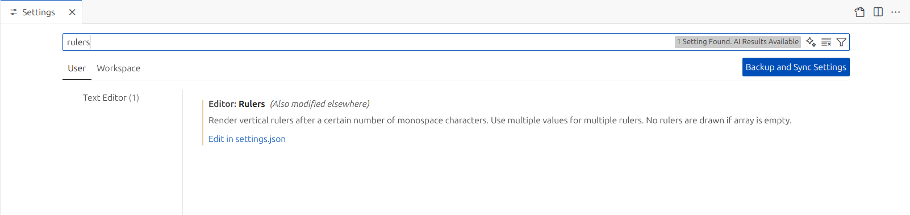
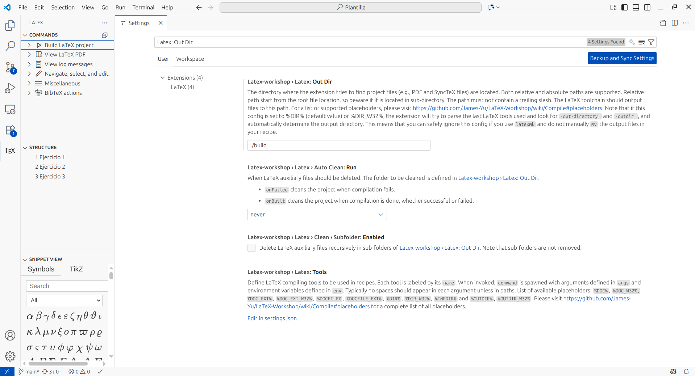

# Plantilla LaTeX para Visual Studio Code (VSC) (Sistema Linux)  
# Tutorial para configurar LaTex en Visual Studio Code (VSC) (Sistema Linux)
<!----------------------------------------------------------------------------------------------------->

## Guía para LaTex en Visual Code Studio
Plantilla de LaTeX lista para usar en **Visual Studio Code (VSC)** en Linux.   
Incluye configuración básica, instalación de extensiones, compilación automática y organización de proyecto en carpetas.  
Ideal para estudiantes y profesionales que quieran escribir documentos en LaTeX desde VS Code de forma rápida y ordenada.  

<!----------------------------------------------------------------------------------------------------->
## Tabla de contenido
- [Configuración básica](## Configuración básica)
- [Tips(Consejos)](## Tips(Consejos))
- [Conectar con el repositorio Git](## Conectar con el repositorio Git)
- [Organización del proyecto](## Organización del proyecto)
- [Recomendación final](## ⚠️Recomendación final:)

<!----------------------------------------------------------------------------------------------------->
## Configuración básica
- **Instalar Visual Studio Code**  
  Accede a [Instalar VSC para Linux](https://code.visualstudio.com/docs/setup/linux) y seguir los pasos
- **Instalar extensiones en VSC**  
  `Ctrl + Shift + X` Accedes a extensiones y seleccionas **LaTex Workshop** de James Yu  
  

    
    
<em>Incono de extensión</em>

  

  

    
    
<em>Imagen de la extensión LaTex Workshop</em>

  

- **Instalar paquetes en Linux**  
  Al no usar esta vez un compilador online tenemos que instalar los paquetes necesarios por nuestra cuenta `sudo apt install texlive-full -y` para los paquetes de LaTex, se puede usar el atajo `Ctrl + '` para abrir el terminal o desde la barra superior
  

    
    
<em>Visualizar terminal de manera interactiva</em>

  

  
<!----------------------------------------------------------------------------------------------------->
## Tips(Consejos)
- Al tener cuenta de estudiante, el **Copilot de Github** se puede usar gratuitamente 
    En caso de querer usarlo, instalar **Github Copilot** y **Github Copilot Chat** en el apartado de extensiones  
    Para conectar con su cuenta de estudiante, sería clickear en tu perfil, y en el apartado de `setting`, ir a la parte de `Emails` y añadir tu cuenta de estudiante
- `Ctrl + S` para guardar/compilar
  

    
    
<em>Guardar de manera interactiva</em>

  

- `Ctrl + Alt + V` para visualizar
  

    
    
<em>Icono para visualizar</em>

  

- Algo que está realmente interesante es que si tienes el `main.pdf` abierto, y le das a compilar, puedes ver los cambios ejercidos en el pdf
- `Ctrl + Alt + X` le abrirá una ventana asociado al compilador de Latex y abajo izquierda con snippet
  

    
    
<em>Icono de los snippet de LaTeX</em>

  

- `Ctrl + I` para abrir **Copilot**(en caso de haberselo instalado)
  

    
    
<em>Iniciar una interacción con el chatbot</em>

  

- **(Muy recomendable)** Para una mejor visualización del entorno `Ctrl + ,` para abrir configuración y aquí  
   hay un par de cosas interesantes que destacar: Para que a la anchura de 80 caracteres le aparezca una línea  
   de delimitación y que si llegas a ese tope se ajuste automáticamente busca en configuración **rulers** y  
   abrir **Edit in setting.json**, luego añadir tras `"workbench.colorTheme": "Default Light Modern",` lo siguiente:  
     `"editor.rulers": [80],`  
     `"editor.wordWrap": "wordWrapColumn",`  
     `"editor.wordWrapColumn": 80,`  
  

    
    
<em>Localización de configuración de manera interactiva</em>

  

  

     
    
<em>Resultado de búsqueda de "rulers"</em>

  

  

    
    
<em>settings.json tras introducir las reglas</em>

  

- **(Muy recomendable)** Configure la salida de los archivos de compilación a la carpeta, pulse `Ctrl + ,` para abrir configuración  
    y busque `Latex: Out Dir` y cambié la salida por `./build`. Una vez compilado el proyecto la salida en format pdf se verá en la carpeta [build](https://github.com/L-51/Plantilla-Latex-VSC/tree/main/build) llamado [main.pdf](https://github.com/L-51/Plantilla-Latex-VSC/blob/main/build/main.pdf)
  

    
    
<em>Resultado y aplicación de establecer la salida</em>

  

<!----------------------------------------------------------------------------------------------------->

## Conectar con el repositorio Git
1. Instalación de **Git** si no lo tenían previamente instalado, `sudo apt install git -y`
2. Configurar tu usuario y correo:  
   `git config --global user.name "Tu Nombre"`  
   `git config --global user.email "tuemail@dominio.com"`
3. Accede a la carpeta donde quieras tener este proyecto guardado y clónalo escribiendo en la terminal  
   de VSC y poner `git clone https://github.com/L-51/Plantilla-Latex-VSC`
4. Abre la carpeta usando **Open Folder** de VSC o la carpeta que te interesa hacer _click derecho_ y abrir con  
   y escribir **code**
5. Para guardar cambios escriba un mensaje de su última modificación y realice un **commit** y si quieres subirlo al repositorio realice **push** que estará en la opción de **Source Control** o con atajo `Ctrl + Shift + G` al lado estará el botón para recibir cambios del repositorio **pull**, en su defecto, a la hora de hacer **commit**, se puede desplegar a la derecha y elegir **Commit & Push** o **Commit & Pull**

  

  

  

  

<!----------------------------------------------------------------------------------------------------->

## Organización del proyecto (Hay texto de ejemplo en los ficheros)
- [**bibliografia**](https://github.com/L-51/Plantilla-Latex-VSC/tree/main/bibliografia) Aquí guardará las referencias en el fichero [ref.bib](https://github.com/L-51/Plantilla-Latex-VSC/blob/main/bibliografia/ref.bib)
- [**build**](https://github.com/L-51/Plantilla-Latex-VSC/tree/main/build) Aquí guardará los archivos temporales a la hora de la compilación y el [pdf de salida](https://github.com/L-51/Plantilla-Latex-VSC/blob/main/build/main.pdf)
- [**config**](https://github.com/L-51/Plantilla-Latex-VSC/tree/main/config) Aquí están los [paquetes](https://github.com/L-51/Plantilla-Latex-VSC/blob/main/config/packages.tex) que usarás y [comandos](https://github.com/L-51/Plantilla-Latex-VSC/blob/main/config/command.tex)
- [**secciones**](https://github.com/L-51/Plantilla-Latex-VSC/tree/main/secciones) Esta carpeta contiene las distintas secciones que forman parte del trabajo
- [**images**](https://github.com/L-51/Plantilla-Latex-VSC/tree/main/images) Carpeta de las imágenes que se usará para el proyecto
- [**portada.tex**](https://github.com/L-51/Plantilla-Latex-VSC/blob/main/portada.tex) Este archivo contiene la portada del trabajo en formato LaTeX
- [**main.tex**](https://github.com/L-51/Plantilla-Latex-VSC/blob/main/main.tex) El main donde se incluirá todo
- [**.gitignore**](https://github.com/L-51/Plantilla-Latex-VSC/blob/main/.gitignore) Es útil cuando piensas crear  
  también un repositorio y hayas seguido la configuración previa para guardar los archivos de compilación en [**build**](https://github.com/L-51/Plantilla-Latex-VSC/tree/main/build)
<!----------------------------------------------------------------------------------------------------->

---  
## ⚠️Recomendación final:
Se recomienda que cada usuario solo edite la parte que le corresponda salvo correcciones para evitar **sobreescritura** del trabajo de otros
